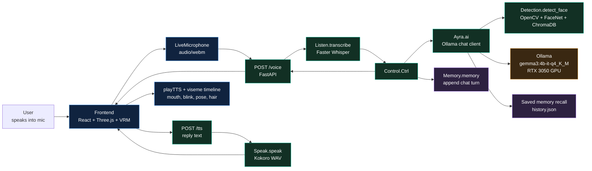
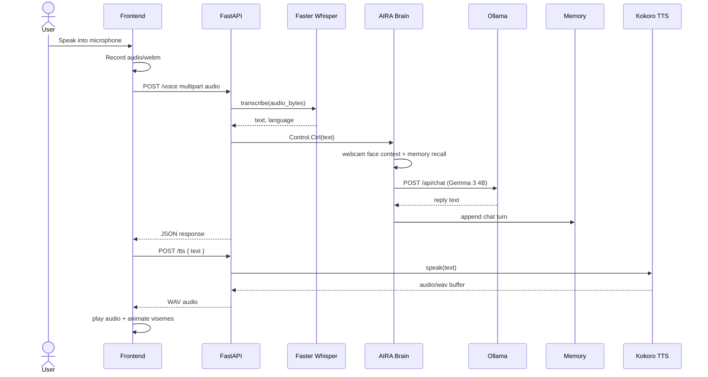

# AIRA v4

<p align="center">
  
  
  
  
</p>

AIRA v4 is a local, voice-interactive AI companion with a browser-based 3D VRM avatar, microphone push-to-talk, speech-to-text, Ollama-powered conversation using Gemma 3 4B with GPU acceleration, local JSON memory, optional face recognition context, and server-side text-to-speech.

The user interacts with the frontend through a live microphone interface. The browser records audio, sends it to FastAPI, the backend transcribes it, asks the Ollama brain for a reply, saves the turn to memory, generates WAV speech, and sends the result back so the VRM avatar can speak with animated mouth shapes.

## Table Of Contents

- [Feature Snapshot](#feature-snapshot)
- [Architecture](#architecture)
- [Repository Map](#repository-map)
- [Quick Start](#quick-start)
- [Frontend](#frontend)
- [Backend](#backend)
- [API Reference](#api-reference)
- [Environment Variables](#environment-variables)
- [ML Models And Face Data](#ml-models-and-face-data)
- [Troubleshooting](#troubleshooting)
- [Development Notes](#development-notes)

## Feature Snapshot

| Area | What it does | Main files |
| --- | --- | --- |
| 3D avatar frontend | React app rendering `Ayra.vrm`, idle motion, blinking, hair motion, mouth animation, and status UI. | `frontend/src/App.jsx`, `frontend/src/engine.js`, `frontend/src/modules/` |
| Live microphone | Push-to-talk recording interface that sends `audio/webm` to the backend. | `frontend/src/components/Microphone/LiveMicrophone.jsx`, `frontend/src/hooks/useLiveMicrophone.js` |
| Speech-to-text | Converts recorded audio into text using Faster Whisper. | `backend/Voice/LISTEN.py` |
| AI brain | Builds prompts, adds recent memory, calls Ollama chat with Gemma 3 4B, and cleans output. | `backend/BRAIN/brain.py`, `backend/BRAIN/llm/ollama.py` |
| Memory | Stores chat turns in JSON and reloads useful past turns. | `backend/MEMORY/memory.py`, `backend/MEMORY/history.json` |
| Face context | Captures webcam frames, verifies against a ChromaDB face collection, and tells the brain whether the user is present. | `backend/face_det/detection.py` |
| Text-to-speech | Uses Kokoro to generate WAV audio for replies. | `backend/Voice/SPEAK.py` |
| Optional translation | English <-> Malayalam translation using IndicTrans2. Present but not currently wired into FastAPI. | `backend/Translation/translation.py` |

## Architecture





## Repository Map

```text
aira_v4/
|-- README.md
|-- requirements.txt
|-- frontend/
|   |-- package.json
|   |-- vite.config.js
|   |-- index.html
|   |-- public/
|   |   `-- models/Ayra.vrm
|   `-- src/
|       |-- App.jsx
|       |-- main.jsx
|       |-- engine.js
|       |-- styles/global.css
|       |-- components/
|       |   `-- Microphone/LiveMicrophone.jsx
|       |-- hooks/
|       |   `-- useLiveMicrophone.js
|       `-- modules/
|           |-- scene.js
|           |-- modelLoader.js
|           |-- pose.js
|           |-- state.js
|           |-- animation.js
|           |-- expression.js
|           |-- viseme.js
|           |-- tts.js
|           |-- mic.js
|           `-- hair.js
|-- backend/
|   |-- .env
|   |-- server/main.py
|   |-- testing.html
|   |-- BRAIN/
|   |   |-- brain.py
|   |   |-- config/
|   |   |   |-- __init__.py
|   |   |   `-- settings.py
|   |   |-- llm/
|   |   |   |-- __init__.py
|   |   |   `-- ollama.py
|   |   |-- prompts/
|   |   |   |-- __init__.py
|   |   |   |-- system.py
|   |   |   `-- builder.py
|   |   |-- processing/
|   |   |   |-- __init__.py
|   |   |   `-- cleaner.py
|   |   `-- models/  (Ollama model storage)
|   |       |-- blobs/
|   |       `-- manifests/
|   |-- AiCONTROL/
|   |   |-- __init__.py
|   |   `-- control.py
|   |-- Voice/
|   |   |-- __init__.py
|   |   |-- LISTEN.py
|   |   `-- SPEAK.py
|   |-- MEMORY/
|   |   |-- __init__.py
|   |   |-- memory.py
|   |   `-- history.json
|   |-- Translation/
|   |   |-- __init__.py
|   |   `-- translation.py
|   `-- face_det/
|       |-- detection.py
|       `-- face_db/
`-- ML_models/
    |-- datasets/my_face/
    |-- processed_faces/
    |-- face_db/
    |-- my_face_processing.ipynb
    `-- normalization_and_embedding.ipynb
```

## Quick Start

### 1. Install Python dependencies

```bash
cd aira_v4
python -m venv .venv
source .venv/bin/activate  # On Windows: .venv\Scripts\activate
python -m pip install --upgrade pip
pip install -r requirements.txt
```

The current code also imports `cv2`, `chromadb`, and `keras_facenet` for face detection. If those are not already installed:

```bash
pip install opencv-python chromadb keras-facenet
```

### 2. Install and configure Ollama

AIRA's brain talks to Ollama at `http://127.0.0.1:11434` by default.

#### Install Ollama

Download and install Ollama from [ollama.com](https://ollama.com)

#### Pull the Gemma 3 4B model

```bash
ollama pull gemma3:4b-it-q4_K_M
```

This downloads the Gemma 3 4B Instruct model with Q4_K_M quantization (~3.3 GB).

#### Start Ollama server

```bash
ollama serve
```

Keep this running in a separate terminal.

#### Verify the model

```bash
ollama list
```

You should see `gemma3:4b-it-q4_K_M` in the list.

### 3. Configure environment variables

Create or verify `backend/.env`:

```env
# Ollama Configuration
OLLAMA_MODEL=gemma3:4b-it-q4_K_M
OLLAMA_URL=http://127.0.0.1:11434

# LLM Configuration
AYRA_CONTEXT_SIZE=8192
AYRA_MAX_TOKENS=250
AYRA_TEMPERATURE=0.6

# Connection Configuration
AYRA_REQUEST_TIMEOUT=120
AYRA_KEEP_ALIVE=1h
```

### 4. Install Node.js dependencies

```bash
cd frontend
npm install
```

### 5. Start the FastAPI backend

```bash
cd backend
python -m uvicorn server.main:app --reload --host 127.0.0.1 --port 8000
```

FastAPI docs should be available at:

```text
http://127.0.0.1:8000/docs
```

### 6. Start the frontend

```bash
cd frontend
npm run dev
```

The Vite dev server will start (usually at `http://localhost:5173`).

Open the URL shown in your terminal, then speak into your microphone to interact with Aira.

## Frontend

The frontend is a React application using Vite as the build tool, with Three.js and `@pixiv/three-vrm` for 3D avatar rendering.

### Main flow

1. **`main.jsx`** - React entry point that mounts the App component.
2. **`App.jsx`** - Main React component that sets up the UI structure and dynamically imports the engine.
3. **`engine.js`** - Core animation engine that owns the render loop and wires all modules together.
4. **`LiveMicrophone.jsx`** - React component for live microphone input interface.
5. **`useLiveMicrophone.js`** - React hook managing microphone recording, backend communication, and response handling.
6. **`modules/`** - Pure JavaScript modules handling scene setup, VRM loading, animation, lip-sync, and audio.

### Architecture layers

```text
React UI Layer
├── App.jsx (UI structure)
├── LiveMicrophone.jsx (microphone interface)
└── useLiveMicrophone.js (recording logic)

Three.js Engine Layer
├── engine.js (render loop coordinator)
└── modules/
    ├── scene.js (Three.js setup)
    ├── modelLoader.js (VRM loading)
    ├── animation.js (idle motion, blink, glance)
    ├── expression.js (VRM morph targets)
    ├── viseme.js (text-to-viseme conversion)
    ├── tts.js (audio playback + lip-sync state)
    ├── mic.js (backend communication)
    ├── pose.js (bone definitions)
    ├── state.js (app state machine)
    └── hair.js (spring physics)
```

<details>
<summary><b>Frontend module reference</b></summary>

| File | Purpose |
| --- | --- |
| `src/main.jsx` | React entry point, mounts App to DOM. |
| `src/App.jsx` | Main component with UI structure, dynamically loads engine. |
| `src/engine.js` | Core render loop coordinator. Wires all Three.js modules together. |
| `src/components/Microphone/LiveMicrophone.jsx` | Live microphone interface React component. |
| `src/hooks/useLiveMicrophone.js` | React hook for microphone recording and backend communication. |
| `src/modules/scene.js` | Creates the Three.js renderer, scene, camera, OrbitControls, and lighting. |
| `src/modules/modelLoader.js` | Loads `Ayra.vrm` through GLTFLoader and VRMLoaderPlugin. |
| `src/modules/pose.js` | Defines tracked humanoid bones and rest pose rotations. |
| `src/modules/state.js` | Maintains `idle`, `listening`, and `speaking` UI states. |
| `src/modules/animation.js` | Adds idle sway, random blink timing, and glance targets. |
| `src/modules/expression.js` | Writes mouth and blink weights to VRM preset expressions. |
| `src/modules/viseme.js` | Converts reply text into timed A/E/I/O/U viseme timeline. |
| `src/modules/tts.js` | Plays backend WAV audio and drives text-based lip sync. |
| `src/modules/mic.js` | Handles backend communication for voice and TTS. |
| `src/modules/hair.js` | Applies spring-damper secondary motion to hair bones. |

</details>

### Browser controls

| Control | Behavior |
| --- | --- |
| Speak into microphone | Live recording sends audio to backend when you stop speaking. |
| Browser console: `ayraSpeak("Hello")` | Runs text-only/synthetic speech animation for quick lip-sync tests. |
| Browser console: `ayraStop()` | Stops current speech playback. |

### Frontend configuration

| Constant | File | Default value |
| --- | --- | --- |
| Voice endpoint | `src/modules/mic.js` | `http://localhost:8000/voice` |
| TTS endpoint | `src/modules/mic.js` | `http://localhost:8000/tts` |
| VRM path | `src/engine.js` | `/models/Ayra.vrm` |
| Three.js version | `package.json` | `0.180.0` |
| React version | `package.json` | `19.1.1` |

## Backend

The backend is a FastAPI service that wires together STT, control, brain, memory, face detection, and TTS.

### Active request path

```text
POST /voice
  -> server.main.voice()
  -> Listen.transcribe()
  -> Control.Ctrl()
  -> Ayra.ai()
  -> OllamaClient.chat()
  -> Ollama /api/chat (Gemma 3 4B Q4_K_M)
  -> Memory.memory()
  -> JSON response

POST /tts
  -> server.main.tts()
  -> Speak.speak()
  -> StreamingResponse(audio/wav)
```

<details>
<summary><b>Backend module reference</b></summary>

| File | Purpose |
| --- | --- |
| `backend/server/main.py` | FastAPI app, CORS configuration, `/voice`, and `/tts` routes. |
| `backend/AiCONTROL/control.py` | High-level control layer. Receives transcribed text, calls the brain, and saves memory. |
| `backend/BRAIN/brain.py` | Ollama-backed conversational brain. Handles environment loading, system prompt, memory retrieval, face context, and request construction. |
| `backend/BRAIN/config/settings.py` | Configuration loader for Ollama URL, model, and LLM parameters from `.env` file. |
| `backend/BRAIN/llm/ollama.py` | Ollama client for chat requests, connection checks, and response parsing. |
| `backend/BRAIN/prompts/builder.py` | Message builder for Ollama chat format with system prompt, context, and user message. |
| `backend/BRAIN/prompts/system.py` | System prompt defining Aira's personality and behavior. |
| `backend/BRAIN/processing/cleaner.py` | Response cleaner to remove thinking blocks, tool calls, and special tokens. |
| `backend/Voice/LISTEN.py` | Faster Whisper speech-to-text wrapper. |
| `backend/Voice/SPEAK.py` | Kokoro text-to-speech wrapper that generates WAV audio. |
| `backend/MEMORY/memory.py` | JSON append-only memory writer for `backend/MEMORY/history.json`. |
| `backend/face_det/detection.py` | Face verification using OpenCV Haar cascade, FaceNet embeddings, and ChromaDB. |
| `backend/Translation/translation.py` | Optional IndicTrans2 English <-> Malayalam translator (not currently enabled). |

</details>

### CORS

`backend/server/main.py` currently allows:

```python
allow_origins=[
    "http://127.0.0.1:5500",
    "http://localhost:5500"
]
```

If you use Vite's dev server (usually port 5173), update CORS to include:

```python
allow_origins=[
    "http://127.0.0.1:5173",
    "http://localhost:5173",
    "http://127.0.0.1:5500",
    "http://localhost:5500"
]
```

## API Reference

### `POST /voice`

Receives recorded browser audio and returns AIRA's text reply.

**Request:**

```text
Content-Type: multipart/form-data
field: audio = recording.webm
```

**Response:**

```json
{
  "response": "Hello there."
}
```

**Command-line test:**

```bash
curl -X POST -F "audio=@recording.webm" http://localhost:8000/voice
```

### `POST /tts`

Receives text and returns WAV audio.

**Request:**

```json
{
  "text": "Hello there."
}
```

**Response:**

```text
Content-Type: audio/wav
```

**Command-line test:**

```bash
curl -X POST http://localhost:8000/tts -H "Content-Type: application/json" -d "{\"text\":\"Hello there.\"}" --output aira.wav
```

## Environment Variables

`backend/BRAIN/config/settings.py` loads environment values from `backend/.env`.

```env
OLLAMA_URL=http://127.0.0.1:11434
OLLAMA_MODEL=gemma3:4b-it-q4_K_M
AYRA_CONTEXT_SIZE=8192
AYRA_MAX_TOKENS=250
AYRA_TEMPERATURE=0.6
AYRA_REQUEST_TIMEOUT=120
AYRA_KEEP_ALIVE=1h
```

| Variable | Default | Used for |
| --- | --- | --- |
| `OLLAMA_URL` | `http://127.0.0.1:11434` | Base URL for Ollama API requests. |
| `OLLAMA_MODEL` | `gemma3:4b-it-q4_K_M` | Chat model sent to `/api/chat`. |
| `AYRA_CONTEXT_SIZE` | `8192` | Ollama `num_ctx` context window. |
| `AYRA_MAX_TOKENS` | `250` | Ollama `num_predict` maximum output tokens. |
| `AYRA_TEMPERATURE` | `0.6` | Reply creativity/randomness (0.0-1.0). |
| `AYRA_REQUEST_TIMEOUT` | `120` | Request timeout in seconds. |
| `AYRA_KEEP_ALIVE` | `1h` | How long Ollama keeps the model loaded in memory. |

## ML Models And Face Data

This repo contains runtime face data and notebooks for building the face database.

| Path | Role |
| --- | --- |
| `ML_models/datasets/my_face/` | Source face image dataset. |
| `ML_models/processed_faces/` | Processed/cropped/normalized face images. |
| `ML_models/my_face_processing.ipynb` | Notebook for face processing workflow. |
| `ML_models/normalization_and_embedding.ipynb` | Notebook for normalization and embedding workflow. |
| `ML_models/face_db/` | ChromaDB output from ML workflow. |
| `backend/face_det/face_db/` | Runtime ChromaDB used by `Detection`. |

**Important:** `backend/face_det/detection.py` currently uses an absolute Chroma path. If the project is moved to another folder, update that path or convert it to a relative path based on `__file__`.

Also treat face images, embeddings, and `MEMORY/history.json` as private data. They can contain biometric and personal conversation information.

## Troubleshooting

| Problem | What to check |
| --- | --- |
| Frontend build errors | Run `npm install` in the `frontend/` directory. |
| Frontend cannot call backend | Update FastAPI CORS origins to include your Vite dev server port (usually 5173). |
| Microphone not working | Check browser permissions, ensure HTTPS or localhost. |
| `/voice` returns no response | Check Faster Whisper logs and whether the audio blob has data. |
| Ollama warning or empty response | Run `ollama serve`, verify model with `ollama list`, check `OLLAMA_URL` and `OLLAMA_MODEL` in `.env`. |
| "Model not found" error | Run `ollama pull gemma3:4b-it-q4_K_M` to download the model. |
| Ollama server not running | Start Ollama with `ollama serve` in a separate terminal. |
| TTS endpoint slow first time | Kokoro needs time to initialize on first request. |
| Face detection always fails | Check webcam access, ChromaDB path, and distance threshold. |
| Import errors | Install missing dependencies: `opencv-python`, `chromadb`, `keras-facenet`. |
| Slow inference speed | Check GPU usage with `ollama ps`. Should show "100% GPU" if GPU is available. |
| Vite dev server issues | Try clearing `node_modules` and reinstalling: `rm -rf node_modules package-lock.json && npm install` |

## Development Notes

- The frontend uses React + Vite for development. The Three.js engine runs in parallel with React.
- Backend URLs are configured in `src/modules/mic.js`.
- Backend CORS is configured in `backend/server/main.py`.
- `Listen.transcribe()` currently forces `language="en"`. Remove that argument for multilingual auto-detection.
- `Translation/translation.py` is implemented but not currently wired into `server/main.py`.
- Lip-sync is text-driven, not audio amplitude-driven. Mouth motion comes from `viseme.js`.
- The VRM model must be placed in `frontend/public/models/Ayra.vrm`.

## GPU Acceleration

AIRA uses Ollama for LLM inference, which automatically detects and uses available GPUs.

### Checking GPU usage

```bash
ollama ps
```

Expected output:

```text
NAME                   ID              SIZE      PROCESSOR    CONTEXT    UNTIL
gemma3:4b-it-q4_K_M    a2af6cc3eb7f    2.9 GB    100% GPU     8192       4 minutes from now
```

The `PROCESSOR` column shows GPU utilization. `100% GPU` means the model is fully offloaded to the GPU.

### Performance expectations

With an NVIDIA RTX 3050 6GB GPU:
- **Inference speed**: ~52-54 tokens/second
- **Model size in VRAM**: ~2.9 GB
- **First-time load**: ~7 seconds
- **Subsequent responses**: <1 second

### CPU fallback

If no GPU is available, Ollama automatically falls back to CPU inference. Performance will be significantly slower (~5-10 tokens/second depending on CPU).

## Project Identity

AIRA is the project shell and interactive avatar system. The conversational character is named `Aira` and is configured as a local AI companion. The system keeps responses short, casual, memory-aware, and grounded by recent conversation history plus optional live room context from face detection.
