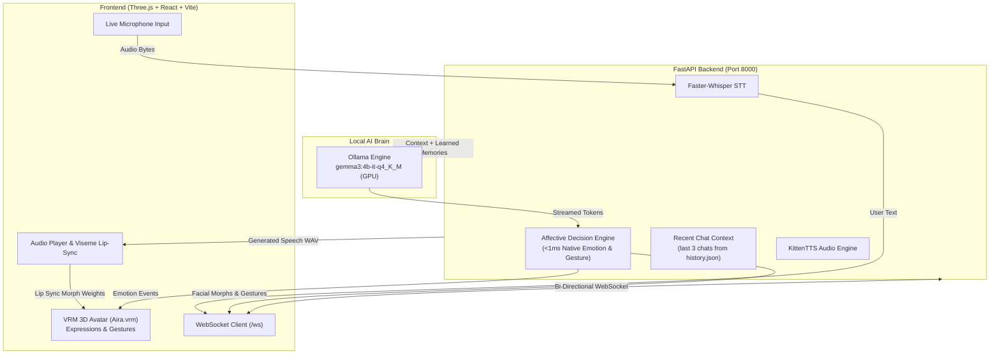

<div align="center">

# ✨ AIRA v4 — Interactive 3D AI Companion ✨

<p align="center">
  
</p>

<p align="center">
  <a href="https://fastapi.tiangolo.com/"></a>
  <a href="https://threejs.org/"></a>
  <a href="https://ollama.com/"></a>
  <a href="https://pytorch.org/"></a>
  <a href="https://developer.mozilla.org/en-US/docs/Web/API/WebSockets_API"></a>
  <a href="https://vitejs.dev/"></a>
</p>

<p align="center">
  <b>Aira</b> is an embodied, expressive 3D AI companion who feels like a real friend. She possesses <b>natural, persistent memory</b> of your identity, projects, and habits, reacts with <b>sub-millisecond affective facial expressions</b>, and engages in <b>low-latency voice conversations</b>.
</p>

---

</div>

## 🌟 Highlight Features

<table width="100%">
  <tr>
    <td width="50%" valign="top">
      <h3>🧠 Conversational Brain (Ollama / Gemma 3)</h3>
      <ul>
        <li><b>High-Speed Local Inference:</b> Native streaming via Ollama (<code>gemma3:4b-it-q4_K_M</code>) or 4-bit Transformers + LoRA.</li>
        <li><b>Concise, Spoken Dialogue:</b> Trained and prompted to speak like a genuine human friend (1–3 sentences, natural conversational fillers).</li>
        <li><b>Token-by-Token WebSocket Streaming:</b> Zero-lag text and audio generation.</li>
      </ul>
    </td>
    <td width="50%" valign="top">
      <h3>💭 Three-Chat Conversation Context</h3>
      <ul>
        <li><b>Recent Chat Context:</b> The latest three valid chats from history.json help maintain continuity.</li>
        <li><b>Contextual Prompt Recall:</b> Adds the latest three saved chats to the LLM prompt.</li>
      </ul>
    </td>
  </tr>
  <tr>
    <td width="50%" valign="top">
      <h3>🎭 Affective Decision Engine (&lt;1ms)</h3>
      <ul>
        <li><b>Zero-Latency Affective Analysis:</b> Analyzes dialogue in <b>0.15ms</b> to select avatar emotions and physical gestures.</li>
        <li><b>9 Expressive Morph Targets:</b> <code>happy</code>, <code>smile</code>, <code>blush</code>, <code>curious</code>, <code>thinking</code>, <code>surprised</code>, <code>sad</code>, <code>angry</code>, <code>neutral</code>.</li>
        <li><b>Dynamic Reaction Curves:</b> Initial emotional reaction peak (1.2–2.0s) that gently softens into conversational speech.</li>
      </ul>
    </td>
    <td width="50%" valign="top">
      <h3>🎙️ Real-Time Voice & Lip Sync</h3>
      <ul>
        <li><b>Speech-to-Text:</b> Faster-Whisper base model for fast, accurate voice input.</li>
        <li><b>Expressive TTS:</b> Ultra-fast KittenTTS generating high-quality 24kHz WAV audio.</li>
        <li><b>Audio-Driven Visemes:</b> Real-time Three.js VRM mouth lip-sync, blinking, and skeletal gesture crossfading.</li>
      </ul>
    </td>
  </tr>
</table>

---

## 🏛️ System Architecture



---

## 🎭 Avatar Expression & Gesture Matrix

Aira's custom decision engine maps conversational tone directly to Three.js VRM blend shapes:

| Emotion | VRM Facial Target | Physical Gesture | Typical Triggers | Reaction Curve |
| :--- | :--- | :--- | :--- | :--- |
| **`happy`** | Joyful squint, smiling mouth, raised brows | `idle` / `wave` | Laughter (*haha*, *lol*), celebration, excitement, good news | Peak: 1.8s, Int: 0.95 |
| **`smile`** | Soft friendly smile, relaxed eyes | `idle` | Warm greetings, cordial agreements, gentle banter | Peak: 1.5s, Int: 0.80 |
| **`blush`** | Cheeks blushing pink, shy charming gaze | `idle` | Flattery, compliments (*cute*, *pretty*), affectionate praise | Peak: 2.0s, Int: 0.92 |
| **`curious`** | Inquisitive raised eyebrow, head tilt | `tilt` | Direct questions (*What do you think?*, *Tell me more!*) | Peak: 1.4s, Int: 0.78 |
| **`thinking`** | Contemplative gaze shift, furrowed brow | `idle` | Deep questions, logic, math, analysis (*Hmm... let me see*) | Peak: 1.4s, Int: 0.78 |
| **`surprised`** | Wide eyes, parted lips, high brows | `idle` | Astonishment (*Wait, what?!*, *No way!*, *Incredible!*) | Peak: 1.8s, Int: 1.00 |
| **`sad`** | Soft empathetic brows, downturned lips | `idle` | Comforting, user hardship (*I'm so sorry*, *That must hurt*) | Peak: 1.8s, Int: 0.85 |
| **`angry`** | Stern brows, narrowed eyes | `idle` | Playful protest, boundary setting (*Stop that!*, *Unacceptable*) | Peak: 1.8s, Int: 0.90 |
| **`neutral`** | Relaxed calm resting face, natural blink | `idle` | Informative facts, balanced conversation | Peak: 1.2s, Int: 0.65 |
| **`wave`** | Smile + Raised arm hand wave animation | `Ayra_Hey` | Greetings (*Hey!*, *Hello!*), goodbyes (*See ya!*) | Crossfade: 1.45s |

---

## 💭 How Aira's Memory Works

Aira keeps the complete chat log in history.json and includes only the latest three valid chats in each prompt.

```text
backend/MEMORY/
└── history.json            # Full chat log; latest three valid chats are used as context
```

### Recent Chat Context
Completed chats are saved to `history.json`. The latest three valid user and assistant exchanges are included in later prompts for continuity.

The full history stays in that file; older chats remain saved but are not included in the prompt context.

---

## 🚀 Quick Start Guide

### Prerequisites
- **OS**: Windows 10/11 (or Linux/macOS)
- **Python**: 3.10 or 3.11+
- **Node.js**: 18+ (for Three.js Vite frontend)
- **Ollama**: Running locally with Gemma 3 4B (`ollama run gemma3:4b-it-q4_K_M`)
- **GPU**: NVIDIA GPU with 4GB–6GB+ VRAM recommended

### 1. Clone & Set Up Backend
```bash
git clone https://github.com/your-username/Aira_v4.git
cd Aira_v4

# Create and activate virtual environment
python -m venv .venv
.venv\Scripts\activate

# Install dependencies
pip install -r requirements.txt
```

### 2. Set Up Frontend
```bash
cd frontend
npm install
cd ..
```

### 3. Launch Services
You can launch both services using the provided one-click scripts:

```bash
# Launch both Backend & Frontend in separate windows
run_all.bat
```
*Or launch individually:*
- **Backend:** `backend.bat` (Starts FastAPI on `http://127.0.0.1:8000`)
- **Frontend:** `frontend.bat` (Starts Vite on `http://localhost:5173`)

---

## 📡 API & WebSocket Reference

### WebSocket Endpoint: `ws://127.0.0.1:8000/ws`

The primary communication channel between avatar frontend and backend.

#### Client to Server:
```json
{
  "type": "user_message",
  "text": "Hey Aira, how are you feeling today?"
}
```

#### Server to Client Event Stream:
1. `{"type": "generation_start"}` — Avatar switches to thinking pose
2. `{"type": "assistant_text", "text": "chunk", "is_chunk": true}` — Token streaming
3. `{"type": "emotion", "emotion": "happy", "intensity": 0.9, "duration": 1.5, "soften_intensity": 0.25}` — Facial reaction trigger
4. `{"type": "animation", "animation": "wave"}` — Skeletal motion trigger
5. `{"type": "tts_audio", "audio": "<base64_wav>", "format": "audio/wav"}` — Lip-sync speech audio
6. `{"type": "generation_end"}` — Speech finished; avatar settles to idle

### REST Endpoints:
- `GET /` — Health status & assistant info
- `GET /health` — Detailed GPU, VRAM, and memory statistics
- `POST /chat` — HTTP text dialogue endpoint
- `POST /voice` — Multipart audio transcription (Faster-Whisper) & dialogue
- `POST /tts` — Generates WAV audio for any text
- `GET /memory` — Read the latest three chats used for conversation context

---

## 📁 Repository Structure

```text
Aira_v4/
├── backend/
│   ├── core/                     # Shared assistant runtime components
│   │   ├── config.py             # Central settings (Ollama model, ports, generation params)
│   │   ├── aira_model.py         # Dual inference engine (Ollama HTTP streaming / PEFT)
│   │   ├── conversation.py       # Context window manager & prompt builder
│   │   ├── decision_engine.py    # Custom Affective Decision Engine
│   │   ├── memory_system.py      # Recent chat context from history.json
│   │   └── response_processor.py # Text cleaner & emotion synchronizer
│   ├── server/
│   │   └── main.py               # FastAPI app & WebSocket endpoint
│   ├── MEMORY/
│   │   └── history.json          # Multi-turn history; last 3 valid chats are used as context
│   └── Voice/
│       ├── LISTEN.py             # Faster-Whisper speech-to-text
│       └── SPEAK.py              # KittenTTS speech synthesis
├── frontend/
│   ├── src/
│   │   ├── App.jsx               # React main view
│   │   ├── engine.js             # Three.js animation & render loop
│   │   ├── expressions/          # 9 VRM facial expression modules
│   │   └── modules/              # Avatar animations, lighting, visemes, WebSocket
│   └── public/
│       └── models/               # VRM 3D Avatar models (Aira.vrm)
├── .gitignore                    # Clean Git push rules (filters large models & caches)
├── requirements.txt              # Unified Python dependencies
├── backend.bat                   # 1-Click Backend Launcher
├── frontend.bat                  # 1-Click Frontend Launcher
└── run_all.bat                   # 1-Click Complete System Launcher
```

---

<div align="center">

Made with ❤️ for embodied, human-like AI companions.

</div>
