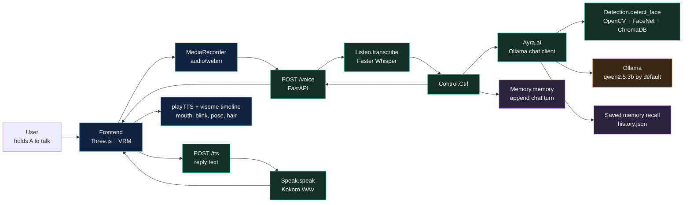
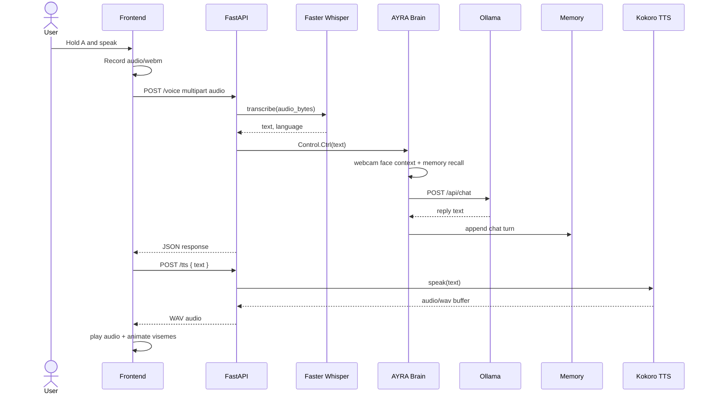

# AYRA v4
<!-- 
<p align="center">
  
</p>

<p align="center">
  <a href="./frontend/video.mp4"><b>Open interface video</b></a>
</p> -->

<p align="center">
  
  
  
  
</p>

AYRA v4 is a local, voice-interactive AI companion with a browser-based 3D VRM avatar, microphone push-to-talk, speech-to-text, Ollama-powered conversation, local JSON memory, optional room/face context, and server-side text-to-speech.

The user talks to the frontend by holding `A`. The browser records audio, sends it to FastAPI, the backend transcribes it, asks the Ollama brain for a reply, saves the turn to memory, generates WAV speech, and sends the result back so the VRM avatar can speak with animated mouth shapes.

## Table Of Contents

- [Feature Snapshot](#feature-snapshot)
- [Architecture](#architecture)
- [Repository Map](#repository-map)
- [Quick Start](#quick-start)
- [Frontend](#frontend)
- [Backend](#backend)
- [Essential Functions](#essential-functions)
- [API Reference](#api-reference)
- [Environment Variables](#environment-variables)
- [ML Models And Face Data](#ml-models-and-face-data)
- [Troubleshooting](#troubleshooting)
- [Development Notes](#development-notes)

## Feature Snapshot

| Area | What it does | Main files |
| --- | --- | --- |
| 3D avatar frontend | Renders `Ayra.vrm`, idle motion, blinking, hair motion, mouth animation, and status UI. | `frontend/index.html`, `frontend/script.js`, `frontend/modules/` |
| Push-to-talk voice | Records `audio/webm` while `A` is held and posts it to the backend. | `frontend/modules/mic.js` |
| Speech-to-text | Converts recorded audio into text using Faster Whisper. | `backend/Voice/LISTEN.py` |
| AI brain | Builds the prompt, adds recent memory and live room context, calls Ollama chat, cleans output. | `backend/BRAIN/brain.py` |
| Memory | Stores chat turns in JSON and reloads useful past turns. | `backend/MEMORY/memory.py`, `backend/MEMORY/history.json` |
| Face context | Captures webcam frames, verifies against a ChromaDB face collection, and tells the brain whether Yadhu is present. | `backend/face_det/detection.py` |
| Text-to-speech | Uses Kokoro to generate WAV audio for replies. | `backend/Voice/SPEAK.py` |
| Optional translation | English <-> Malayalam translation using IndicTrans2. Present but not currently wired into FastAPI. | `backend/Translation/translation.py` |

## Architecture





## Repository Map

```text
ayra_v4/
|-- README.md
|-- requirements.txt
|-- ayra_pic.png
|-- frontend/
|   |-- index.html
|   |-- style.css
|   |-- script.js
|   |-- Ayra.vrm
|   |-- video.mp4
|   |-- README.md
|   `-- modules/
|       |-- scene.js
|       |-- modelLoader.js
|       |-- pose.js
|       |-- state.js
|       |-- animation.js
|       |-- expression.js
|       |-- viseme.js
|       |-- tts.js
|       |-- mic.js
|       `-- hair.js
|-- backend/
|   |-- server/main.py
|   |-- run_ayra.bat
|   |-- testing.html
|   |-- BRAIN/brain.py
|   |-- AiCONTROL/control.py
|   |-- Voice/LISTEN.py
|   |-- Voice/SPEAK.py
|   |-- MEMORY/memory.py
|   |-- MEMORY/history.json
|   |-- Translation/translation.py
|   `-- face_det/
|       |-- detection.py
|       `-- face_db/
`-- ML_models/
    |-- datasets/my_face/
    |-- processed_faces/
    |-- face_db/
    |-- my_face_processing.ipynb
    `-- normalization_and_embedding.ipynb
```

## Quick Start

### 1. Install Python dependencies

```powershell
cd C:\ayra_v4
py -3 -m venv .venv
.\.venv\Scripts\Activate.ps1
python -m pip install --upgrade pip
pip install -r requirements.txt
```

The current code also imports `cv2`, `chromadb`, and `keras_facenet` for face detection. If those are not already installed in your environment, install them too:

```powershell
pip install opencv-python chromadb keras-facenet
```

### 2. Start Ollama

AYRA's brain talks to Ollama at `http://localhost:11434` by default.

```powershell
ollama serve
ollama pull qwen2.5:3b
```

You can use a different local model through `backend/.env`.

### 3. Start the FastAPI backend

```powershell
cd C:\ayra_v4\backend
python -m uvicorn server.main:app --reload --host 127.0.0.1 --port 8000
```

FastAPI docs should be available at:

```text
http://127.0.0.1:8000/docs
```

### 4. Start the frontend

The frontend must be served through HTTP because ES modules, microphone access, and VRM loading should not run from `file://`.

```powershell
cd C:\ayra_v4\frontend
python -m http.server 5500
```

Open:

```text
http://localhost:5500
```

Then click the page once to warm audio/microphone permissions, hold `A` to record, and release `A` to send the message.

## Frontend

The frontend is a vanilla ES-module browser app using Three.js and `@pixiv/three-vrm` from CDN import maps.

### Main flow

1. `index.html` creates the page shell, background video, status overlay, push-to-talk hint, and import map.
2. `script.js` imports all modules, loads `Ayra.vrm`, starts the render loop, and connects microphone results to speech playback.
3. `mic.js` records audio while `A` is held, sends it to `/voice`, then asks `/tts` for a WAV version of the reply.
4. `tts.js` plays the WAV and updates `lipSyncState`.
5. `script.js` reads `lipSyncState` on every frame and passes mouth weights to `expression.js`.
6. `animation.js`, `hair.js`, and `pose.js` keep the avatar alive with idle body movement, blinking, glance motion, hand rest pose, and hair spring motion.

<details>
<summary><b>Frontend module reference</b></summary>

| File | Purpose |
| --- | --- |
| `frontend/script.js` | Main entry point. Owns the render loop, global console helpers, app startup, and result handling from `mic.js`. |
| `frontend/modules/scene.js` | Creates the Three.js renderer, transparent scene, perspective camera, OrbitControls, lighting, and resize behavior. |
| `frontend/modules/modelLoader.js` | Loads `Ayra.vrm` through `GLTFLoader` and `VRMLoaderPlugin`, optimizes the scene, initializes tracked bones, fits the camera, and hides the loading overlay. |
| `frontend/modules/pose.js` | Defines tracked humanoid bones, finger bone names, rest pose rotations, and relaxed hand curl values. |
| `frontend/modules/state.js` | Maintains `idle`, `listening`, and `speaking` UI states and updates the status label/microphone note. |
| `frontend/modules/animation.js` | Adds idle sway, random blink timing, and glance targets, especially while listening. |
| `frontend/modules/expression.js` | Writes mouth and blink weights to VRM preset expressions and custom `Fcl_MTH_*` clips when available. |
| `frontend/modules/viseme.js` | Converts reply text into a timed A/E/I/O/U viseme timeline with attack, sustain, release, and coarticulation blending. |
| `frontend/modules/tts.js` | Plays backend WAV audio with `AudioBufferSourceNode`, drives text-based lip sync, and provides a synthetic lip-sync fallback if audio is unavailable. |
| `frontend/modules/mic.js` | Handles microphone permission, push-to-talk recording, backend round trips, TTS fetches, and speaking guard logic. |
| `frontend/modules/hair.js` | Finds VRM hair bones named like `J_Sec_Hair*_ *` and applies spring-damper secondary motion from head movement. |

</details>

### Browser controls

| Control | Behavior |
| --- | --- |
| Click page once | Warms the `AudioContext` and requests microphone permission. |
| Hold `A` | Starts recording through `MediaRecorder`. |
| Release `A` | Stops recording and sends the WebM audio to the backend. |
| Browser console: `ayraSpeak("Hello")` | Runs text-only/synthetic speech animation for quick lip-sync tests. |
| Browser console: `ayraStop()` | Stops current speech playback. |

### Frontend constants to know

| Constant | File | Current value |
| --- | --- | --- |
| Push-to-talk key | `frontend/modules/mic.js` | `a` |
| Voice endpoint | `frontend/modules/mic.js` | `http://localhost:8000/voice` |
| TTS endpoint | `frontend/modules/mic.js` | `http://localhost:8000/tts` |
| VRM path | `frontend/script.js` | `./Ayra.vrm` |
| Three.js version | `frontend/index.html` import map | `0.180.0` |

## Backend

The backend is a FastAPI service that wires together STT, control, brain, memory, face detection, and TTS.

### Active request path

```text
POST /voice
  -> server.main.voice()
  -> Listen.transcribe()
  -> Control.Ctrl()
  -> Ayra.ai()
  -> Ollama /api/chat
  -> Memory.memory()
  -> JSON response

POST /tts
  -> server.main.tts()
  -> Speak.speak()
  -> StreamingResponse(audio/wav)
```

<details>
<summary><b>Backend module reference</b></summary>

| File | Purpose |
| --- | --- |
| `backend/server/main.py` | FastAPI app, CORS configuration, `/voice`, and `/tts` routes. |
| `backend/AiCONTROL/control.py` | High-level control layer. Receives transcribed text, calls the brain, prints timing/debug info, and saves memory. |
| `backend/BRAIN/brain.py` | Ollama-backed conversational brain. Handles environment loading, system prompt, memory retrieval, face context, request construction, response cleaning, and in-session memory. |
| `backend/Voice/LISTEN.py` | Faster Whisper speech-to-text wrapper. Writes incoming audio bytes to a temporary `.webm`, transcribes, and deletes the temp file. |
| `backend/Voice/SPEAK.py` | Kokoro text-to-speech wrapper. Sanitizes text, generates audio chunks, concatenates them, and returns a WAV `BytesIO` buffer. |
| `backend/MEMORY/memory.py` | JSON append-only memory writer for `backend/MEMORY/history.json`. |
| `backend/face_det/detection.py` | Face verification using OpenCV Haar cascade, FaceNet embeddings, and a persistent ChromaDB collection. |
| `backend/Translation/translation.py` | Optional IndicTrans2 English <-> Malayalam translator. Currently not enabled in `server/main.py`. |
| `backend/testing.html` | Browser `speechSynthesis` test page, separate from the Kokoro backend TTS path. |
| `backend/run_ayra.bat` | Starts the console control loop with `py -3 AiCONTROL\control.py`. |

</details>

### CORS

`backend/server/main.py` currently allows:

```text
http://127.0.0.1:5500
http://localhost:5500
```

If the frontend runs on another port, update `allow_origins`.

## Essential Functions

### Backend functions

| Function | Why it matters |
| --- | --- |
| `voice(audio)` in `backend/server/main.py` | Accepts uploaded microphone audio, reads bytes, runs STT, calls the control layer, and returns `{"response": ...}` to the browser. |
| `tts(req)` in `backend/server/main.py` | Accepts reply text, calls Kokoro TTS, and streams WAV audio back to the frontend. |
| `Listen.transcribe(audio_bytes)` | Converts raw uploaded WebM bytes into text. It uses Faster Whisper with `beam_size=5`, VAD filtering, and currently forces `language="en"`. |
| `Control.Ctrl(text)` | The backend's main orchestration point for a transcribed message. It calls `Ayra.ai()`, logs the turn, and persists memory. |
| `Ayra.__init__()` | Loads `.env`, configures Ollama/model settings, initializes face detection, loads saved memory, seeds recent history, and checks Ollama availability. |
| `Ayra.ai(text)` | Builds room context and memory context, posts chat messages to Ollama, cleans the model output, saves the turn in RAM, and returns the final reply. |
| `Ayra._build_messages(user_text, face_context)` | Creates the Ollama chat payload: system prompt, optional face context, optional relevant memory, recent history, and the latest user message. |
| `Ayra._relevant_saved_memories(user_text)` | Scores saved memory turns by token overlap and recall keywords like `remember`, `earlier`, or `before`. |
| `Ayra._clean(text)` | Removes model artifacts such as `<think>`, tool-call blocks, special tokens, assistant labels, emojis, and extra whitespace. |
| `Ayra.face_detection()` | Captures up to four webcam frames and asks `Detection.detect_face()` whether the known user is present. |
| `Detection.detect_face(screenshots)` | Detects faces with Haar cascade, creates FaceNet embeddings, queries ChromaDB, and returns `True` when nearest distance is below `0.5`. |
| `Speak._sanitize_text(text)` | Normalizes newlines and whitespace before TTS generation. |
| `Speak.speak(text)` | Generates Kokoro audio chunks, concatenates them with NumPy, writes a 24 kHz WAV into memory, and returns a streamable buffer. |
| `Memory.memory(chat)` | Opens `history.json`, appends the chat object, and writes formatted JSON back to disk. |
| `Translator.en_to_mal()` / `Translator.mal_to_en()` | Optional translation helpers backed by IndicTrans2 models. |

### Frontend functions

| Function | Why it matters |
| --- | --- |
| `loadVRM(vrmPath)` | Loads the avatar model, registers the VRM plugin, initializes expressions/hair/bones, fits the camera, and enters the idle state. |
| `animate()` in `frontend/script.js` | Main render loop. Updates body pose, blink, glance, mouth visemes, hair physics, VRM spring bones, controls, and renderer. |
| `setOnResult(fn)` | Lets `script.js` receive backend reply text and optional TTS audio from `mic.js`. |
| `ensureMicStream()` | Requests microphone access with echo cancellation, noise suppression, mono channel preference, and auto gain control. |
| `handleRecordingStop()` | Converts recorded chunks into a WebM blob, posts it to `/voice`, fetches `/tts`, and passes both reply text and audio back to the app. |
| `playTTS(text, audioBlob, _startTime, onEnd)` | Builds a viseme timeline, decodes/plays WAV audio when present, or runs synthetic text-only lip sync when audio is missing. |
| `buildVisemeTimeline(text)` | Converts text characters into timed A/E/I/O/U mouth-shape events. |
| `getVisemeState(timeline, time)` | Returns current and next viseme weights for smooth coarticulation during playback. |
| `applyMouth(targetWeights, dampF)` | Smooths mouth and blink values, then writes them to VRM expression presets and custom mouth clips. |
| `applyIdleSway(target, time)` | Adds subtle hips/chest movement so the avatar does not feel frozen. |
| `updateBlink(time)` | Generates randomized blink envelopes. |
| `updateListenGlance(time)` | Produces head and eye glance targets, stronger while listening. |
| `initHair(vrm)` | Finds hair bones by name and stores spring-damper metadata. |
| `updateHair(delta)` | Applies secondary hair motion based on head angular velocity. |
| `setState(next)` | Updates frontend state and visual status text for `idle`, `listening`, and `speaking`. |

## API Reference

### `POST /voice`

Receives recorded browser audio and returns AYRA's text reply.

Request:

```text
Content-Type: multipart/form-data
field: audio = recording.webm
```

Response:

```json
{
  "response": "Hello, Yadhu."
}
```

Command-line test:

```powershell
curl.exe -X POST -F "audio=@recording.webm" http://localhost:8000/voice
```

### `POST /tts`

Receives text and returns WAV audio.

Request:

```json
{
  "text": "Hello, Yadhu."
}
```

Response:

```text
Content-Type: audio/wav
```

Command-line test:

```powershell
curl.exe -X POST http://localhost:8000/tts -H "Content-Type: application/json" -d "{\"text\":\"Hello, Yadhu.\"}" --output ayra.wav
```

## Environment Variables

`backend/BRAIN/brain.py` loads environment values from `backend/.env`.

```env
OLLAMA_URL=http://localhost:11434
OLLAMA_MODEL=qwen2.5:3b
AYRA_CONTEXT_SIZE=2048
AYRA_MAX_TOKENS=80
AYRA_TEMPERATURE=0.85
AYRA_HISTORY_LIMIT=8
AYRA_MEMORY_RECALL_LIMIT=3
AYRA_MEMORY_SCAN_LIMIT=800
AYRA_MEMORY_MESSAGE_CHARS=220
```

| Variable | Default | Used for |
| --- | --- | --- |
| `OLLAMA_URL` | `http://localhost:11434` | Base URL for Ollama API requests. |
| `OLLAMA_MODEL` | `qwen2.5:3b` | Chat model sent to `/api/chat`. |
| `AYRA_CONTEXT_SIZE` | `2048` | Ollama `num_ctx`. |
| `AYRA_MAX_TOKENS` | `80` | Ollama `num_predict`. |
| `AYRA_TEMPERATURE` | `0.85` | Reply creativity/randomness. |
| `AYRA_HISTORY_LIMIT` | `8` | Number of recent turns kept in active prompt history. |
| `AYRA_MEMORY_RECALL_LIMIT` | `3` | Maximum relevant saved memory turns included in the prompt. |
| `AYRA_MEMORY_SCAN_LIMIT` | `800` | Saved memory entries scanned and retained. |
| `AYRA_MEMORY_MESSAGE_CHARS` | `220` | Maximum stored message snippet size used for prompt memory. |

## ML Models And Face Data

This repo contains runtime face data and notebooks for building the face database.

| Path | Role |
| --- | --- |
| `ML_models/datasets/my_face/` | Source face image dataset. |
| `ML_models/processed_faces/` | Processed/cropped/normalized face images. |
| `ML_models/my_face_processing.ipynb` | Notebook for face processing workflow. |
| `ML_models/normalization_and_embedding.ipynb` | Notebook for normalization and embedding workflow. |
| `ML_models/face_db/` | ChromaDB output from ML workflow. |
| `backend/face_det/face_db/` | Runtime ChromaDB used by `Detection`. |

Important: `backend/face_det/detection.py` currently uses an absolute Chroma path:

```python
path=r"C:\ayra_v4\backend\face_det\face_db"
```

If the project is moved to another folder, update that path or convert it to a relative path based on `__file__`.

Also treat face images, embeddings, and `MEMORY/history.json` as private data. They can contain biometric and personal conversation information.

## Troubleshooting

| Problem | What to check |
| --- | --- |
| Frontend model does not load | Serve `frontend/` over HTTP, not `file://`. Use `python -m http.server 5500` or VS Code Live Server. |
| Browser cannot call backend | Keep frontend on `localhost:5500` / `127.0.0.1:5500`, or update FastAPI CORS origins. |
| Microphone is blocked | Click the page once, allow microphone permission, and use `localhost` rather than a plain file path. |
| `/voice` returns no response | Check microphone input, Faster Whisper load logs, and whether the audio blob has size. |
| Ollama warning or empty brain response | Run `ollama serve`, pull the configured model, and confirm `OLLAMA_URL` / `OLLAMA_MODEL`. |
| TTS endpoint is slow first time | Kokoro may need time to initialize and generate the first audio chunks. |
| Face detection always fails | Check webcam access, the ChromaDB collection name `my_face`, the hard-coded DB path, and the distance threshold `0.5`. |
| Import errors for face detection | Install `opencv-python`, `chromadb`, and `keras-facenet`. |
| Frontend is stuck speaking/listening | Use `ayraStop()` from the browser console, then refresh if needed. |

## Development Notes

- The frontend backend URLs are hard-coded in `frontend/modules/mic.js`.
- The backend CORS list is hard-coded in `backend/server/main.py`.
- `Listen.transcribe()` currently passes `language="en"` even though the nearby comment says auto-detect. Remove that argument if multilingual auto-detection is desired.
- `Translation/translation.py` is implemented, but `server/main.py` has translator wiring commented out.
- `tts.js` lip sync is text-driven, not audio amplitude-driven. The analyser node is present for future use, but mouth motion comes from `viseme.js`.
- `run_ayra.bat` starts the console control loop, not the FastAPI server.
- `backend/testing.html` tests the browser's built-in `speechSynthesis`; it is separate from the Kokoro `/tts` pipeline.

## Project Identity

AYRA is the project shell and interactive avatar system. The current active brain prompt names the conversational character `Aira` and frames her as Yadhu's local AI companion. The code keeps responses short, casual, memory-aware, and grounded by recent history plus optional live room context.
